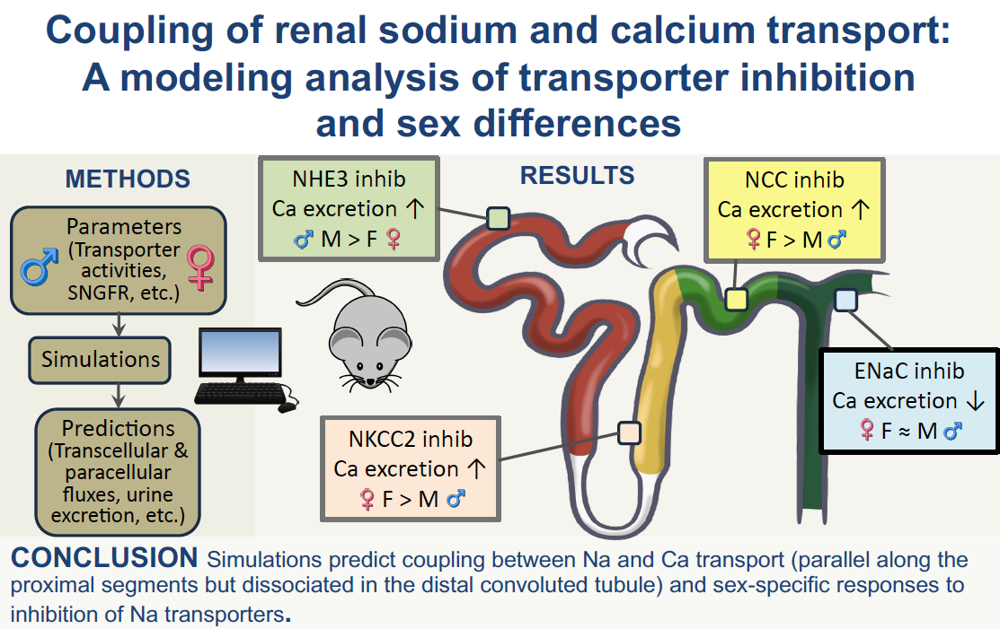

# About
This is the mathematical model for epithelial transport along the nephron, specifically focusing on calcium transport which is implemented in Python 3. The models account for sex differences, providing a better understanding of nephron functionality. To improve computation time, parallel computation of different types of nephrons is implemented for the multiple nephron model. 

The results of calcium transport along the superficial nephron along with sodium and calcium-related inhibitions are given in the paper "Coupling of renal sodium and calcium transport: A modelling analysis of transporter inhibition and sex differences".

**Supplemantry material** providing transport and delivery values for various nephron segments for sodium and calcium for NHE3, NKCC2, NCC, ENaC and Calcium related inhibitions are provided in the Supplemantary Material" folder.

# Instructions
To run the parallel simulation code use command: **python3 parallel_simulate.py --sex [option] --species [option] --type [option] --diabetes [option] --inhibition [option] --pregnant [option]**

The options here are:

sex: **Male, Female** (required);

species: **rat** (required);

type: **superficial, multiple** (required);

diabetes: **Severe, Moderate, Non** (optional, default: Non);

pregnant: **mid, late** (optional, default: non, only for female rat);

inhibition: **ACE, SGLT2, NHE3-50, NHE3-80, NKCC2-70, NKCC2-100, NCC-70, NCC-100, ENaC-70, ENaC-100, SNB-70, SNB-100** (optional, default: None).

unx: **N, Y** (optional, default: N)

Notes:
* Calcium transport is currently made for the rat model only.
* Calcium-related alterations in transporters and channels in diabetes and pregnancy are a work in progress. 

### Understanding output

All the output files' names are in following structure: 'sex_species_segment_concentration/flow_of_solute_in_compartment.txt'. 

Here is an example: female_rat_ccd_con_of_Cl_in_Bath.txt. It contains interstitial concentration of Chloride along cortical collecting duct in female rat.

Another example: male_hum_pt_flow_of_Na_in_Lumen.txt. It contains luminal flow of Sodium along proximal convolute tubule in male human.

These results are scaled per nephron.

The unit of concentration from outputs is **mmol/L (mM)**.

The unit of volume is **nl/min**.

The unit of flow is **pmol/min**.

**/plot/** contains some example scripts for plotting output
<!-- 
## Related Work
Please cite the appropriate paper when using this model for calcium transport-related purposes.

Previously published papers based on the previous epithelial solute and water transport model (does not include calcium transport):
* **multiple nephron model (male only):** [2016 Layton et al. "A computational model for simulating solute transport and oxygen consumption along the nephrons"](https://journals.physiology.org/doi/full/10.1152/ajprenal.00293.2016)
* **superficial nephron (sex-specific):** [2019 Hu et al. "Functional implications of the sex differences in transporter abundance along the rat nephron: modeling and analysis"](https://journals.physiology.org/doi/full/10.1152/ajprenal.00352.2019)
* **multiple nephron (sex-specific):** [2020 Hu et al. "Sex differences in solute transport along the nephrons: effects of Na+ transport inhibition"](https://journals.physiology.org/doi/abs/10.1152/ajprenal.00240.2020?rfr_dat=cr_pub++0pubmed&url_ver=Z39.88-2003&rfr_id=ori%3Arid%3Acrossref.org)
* **human multiple nephron (male only):** [2019 Layton and Layton "A computational model of epithelial solute and water transport along a human nephron"](https://journals.plos.org/ploscompbiol/article?rev=2&id=10.1371/journal.pcbi.1006108)
* **human multiple nephron (sex-specific):** [2021 Hu et al. "Sex differences in solute and water handling in the human kidney: Modeling and functional implications"](https://www.sciencedirect.com/science/article/pii/S2589004221006350)
* **diabetic human (sex-specific):** [2021 Hu et al. "A Computational Model of Kidney Function in a Patient with Diabetes"](https://www.mdpi.com/1422-0067/22/11/5819)
* **pregnant rat (superficial nephron):** [2022 Stadt and Layton "Adaptive changes in single-nephron GFR, tubular morphology, and transport in a pregnant rat nephron: modeling and analysis"](https://journals.physiology.org/doi/abs/10.1152/ajprenal.00264.2021)
-->
### Previous versions
Previous versions of this model code are available [here](https://github.com/Layton-Lab/nephron) and  [here](https://github.com/uwrhu).
